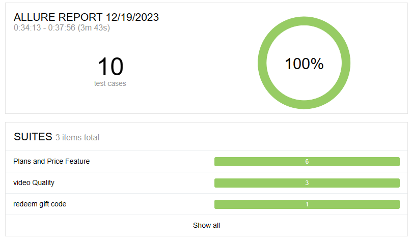

## Project
this project is top test the subscription options for STC gulf.

## Installation

clone the repo and run the following command

```bash
  mvn clean test
```
by default project runs on Google Chrome . if you want it to run on a different browser use the follwoing commands

```bash
  mvn clean test -DtargetBrowserName = firefox
  mvn clean test -DtargetBrowserName = MicrosoftEdge
```
by default project runs in headless mode. this can be changed in the config files.

by default there is 3 reports generated after execution. it is configured to take screenshots only for validations and gif and video options are disabled but can be triggered from configurations.


